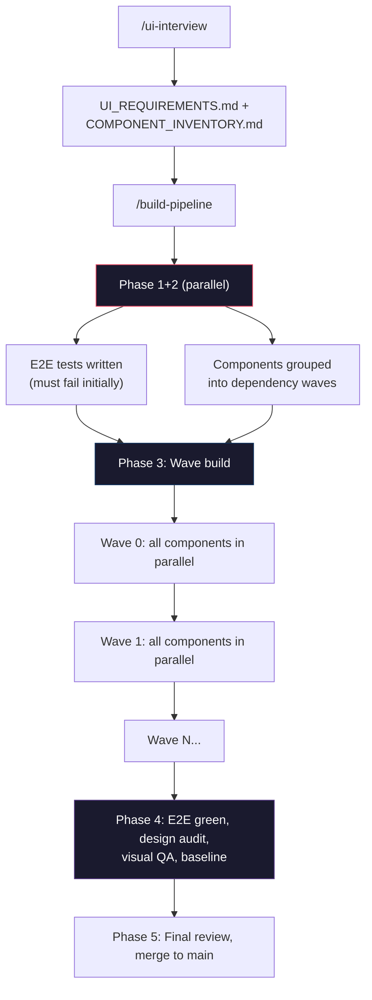

# Frontend Orchestration

A Claude Code plugin that builds your entire frontend from a conversation. Describe what you want, it interviews you, writes tests, builds components, audits everything, and opens PRs — dependency order, TDD, configurable approval gates.

`/ui-interview` asks about pages, components, data flows, and edge cases. `/build-pipeline` resolves components into dependency waves (leaf nodes first), writes failing tests, builds to green, and audits each wave before opening PRs. Nothing ships without passing every gate. In `interactive` mode, the pipeline pauses at each gate and returns control to your Claude Code session — you review and decide whether to continue. In the default `auto` mode, gates are logged and auto-approved. In `ci` mode, gates reject automatically.

## Quick start

From your workspace root (the directory you open Claude Code in):

```sh
# 1. Clone — the target directory name matters, don't change it
git clone https://github.com/Jakemo136/frontend-orchestrator.git \
  .claude/plugins/frontend-orchestration

# 2. Install deps, browsers, and register commands
.claude/plugins/frontend-orchestration/setup.sh
```

The plugin **must** live at `.claude/plugins/frontend-orchestration/` relative to your workspace root.

Setup installs dependencies, Playwright browsers, and symlinks commands into `.claude/commands/` for discovery. It also offers to install **quality gate hooks** that block `git commit` until code-review and code-simplify have run in the current session. Hooks are recommended but optional — decline during setup or install later via `setup/install-hooks.md`. Restart Claude Code after install, then verify with `/session-start`.

Create `orchestrator.config.yaml` in your project root:

```yaml
project: my-app
scope:
  type: app
  target: null
branches:
  main: main
  feature: null
artifacts:
  requirements: docs/UI_REQUIREMENTS.md
  inventory: docs/COMPONENT_INVENTORY.md
  build_plan: docs/BUILD_PLAN.md
  build_status: docs/BUILD_STATUS.md
  design_audit: docs/DESIGN_AUDIT.md
  visual_qa: docs/VISUAL_QA.md
commands:
  test_client: npm test
  test_server: cd server && npm test
  test_e2e: npx playwright test
  build_client: npm run build
  dev_server: npm run dev
  typecheck: npx tsc --noEmit
ci:
  required_on_main: [client, e2e]
  required_on_feature: [client]
  informational_on_feature: [e2e]
approval_mode: interactive
```

## Commands

| Command | What it does |
|---|---|
| `/session-start` | Reorient at the start of a session |
| `/ui-interview` | Requirements interview — produces UI_REQUIREMENTS.md and COMPONENT_INVENTORY.md |
| `/user-story-generation` | Generate PM-voice user stories with data flow annotations for all interactive flows |
| `/build-component [Name]` | Build one component TDD-style (also accepts `--wave N` for pipeline use) |
| `/build-page [Page]` | Build all components for a page, parallelized by dependency wave |
| `/build-pipeline` | Full autonomous build: E2E tests, dependency waves, audits, PRs |
| `/review-requirements` | Summarize build state, suggest next step |
| `/fo-code-review` | Dispatch `superpowers:code-reviewer` against recent changes |
| `/code-simplify` | Dispatch `code-simplifier:code-simplifier` against recent changes |
| `/wiring-audit` | Verify integration test coverage for parent-child component relationships |
| `/design-audit [route?]` | A11y + design audit at all breakpoints, auto-fix critical issues |
| `/visual-qa [route?]` | UX quality review — Nielsen's heuristics, Gestalt, frustration signals |
| `/set-baseline [route?]` | Promote screenshots to visual regression baseline |

## Approval modes

| Mode | Behavior | Use when |
|------|----------|----------|
| `auto` (default) | Gates log and auto-approve | Rapid prototyping, trusted automation |
| `interactive` | Pipeline pauses, returns control to your session | Production builds, review-gated workflows |
| `ci` | Gates reject automatically | CI/CD pipelines, zero-human-input runs |

Set `approval_mode` in `orchestrator.config.yaml`.

### Steps with approval gates

| Step | Prompt | What the user reviews |
|------|--------|-----------------------|
| `dependency-resolve` | "Review and approve build plan" | Wave assignments in BUILD_PLAN.md |
| `set-baseline` | "Approve screenshots as baseline" | Screenshots before promoting to regression baseline |
| `merge-to-main` | "Approve merge to main" | Final merge of the feature branch |

### Interactive pause/resume

When a step calls `awaitApproval` in `interactive` mode:

1. The runner throws a `NeedsApprovalSignal` — a plain object (not an Error) with `{ __type: "needs_approval", stepId, prompt }`
2. The CLI catches the signal and returns control to your Claude Code session
3. You review the artifact referenced in the prompt
4. Resume with `--approval-result stepId=true` (approve) or `stepId=false` (deny)
5. On resume, the cached result is read — the handler proceeds or throws `ApprovalDeniedError`

In `auto` mode, all gates log and proceed immediately. In `ci` mode, all gates throw `ApprovalDeniedError`.

### Approval audit trail

Every approval is recorded in `.orchestrator/state.json` under `state.approvals[]`:

```json
{
  "stepId": "dependency-resolve",
  "prompt": "Review and approve build plan: docs/BUILD_PLAN.md",
  "mode": "interactive",
  "approved_at": "2026-04-23T14:30:00.000Z"
}
```

## How it works



Each phase gates on the previous. The pipeline resumes from any checkpoint. Within each wave, all components build in parallel via separate subagents — audits, screenshots, and reviews also parallelize per route.

## What's inside

```
frontend-orchestration/
  commands/       13 slash commands + 3 internal pipeline subcommands
  subagents/      8 specialized agents (component-builder, e2e-writer, etc.)
  runner/         DAG executor, state machine, evidence pipeline, step implementations
  mcp/            2 MCP servers (a11y-scanner, screenshot-review + visual regression)
  standards/      Design, a11y, and UX quality checklists
  docs/           Quality matrix, audit findings, implementation plans
  setup/          Hooks, install script, quality gate config
```

See [`docs/QUALITY_MATRIX.md`](docs/QUALITY_MATRIX.md) for which checks are runner-enforced vs. prompt-delegated vs. manual.

## Audit layers

The audits aren't an LLM guessing — automated tooling produces hard data, then agents review what the tools can't catch.

| Layer | What runs | How |
|-------|-----------|-----|
| **axe-core** | WCAG 2.2 AA scan against live DOM | a11y-scanner MCP → real Chromium |
| **Screenshots** | Full-page captures at 375/768/1280/1440px | screenshot-review MCP → Playwright |
| **Visual regression** | Pixel-level diff against baseline | pixelmatch with configurable threshold |
| **Composition review** | Agent reviews screenshots as a first-time user | Checklist: hierarchy, alignment, duplicates, empty states |
| **Codified standards** | WCAG AA, Nielsen's 10, Gestalt, contrast, touch targets | `standards/design-and-a11y.md`, `standards/ux-quality.md` |
| **Auto-fix + re-verify** | Fix Critical/Major → re-run full audit | Rollback-safe: git stash → fix → verify → rollback on regression |
| **UX quality** | Separate `/visual-qa` pass | Heuristics, interaction quality, 10 frustration signals |

Critical/Major issues are auto-fixed and re-verified. Minor issues are flagged for human review. `/visual-qa` runs after `/design-audit` — a11y compliance first, then UX.

## Evidence pipeline

E2E test runs collect Playwright traces, failure screenshots, and a machine-readable `evidence-manifest.json` — all persisted to `.orchestrator/evidence/`.

## Compatibility

The runner is framework-agnostic — it executes shell commands from your config and tracks state in JSON. The testing conventions (post-wave review, wiring audit) are designed for React + GraphQL + Vitest + RTL + Playwright + MSW. Other stacks work with the runner but need adapted command specs. See `runner/README.md` for the full compatibility matrix.

## Requirements

- Node.js 20+, Claude Code
